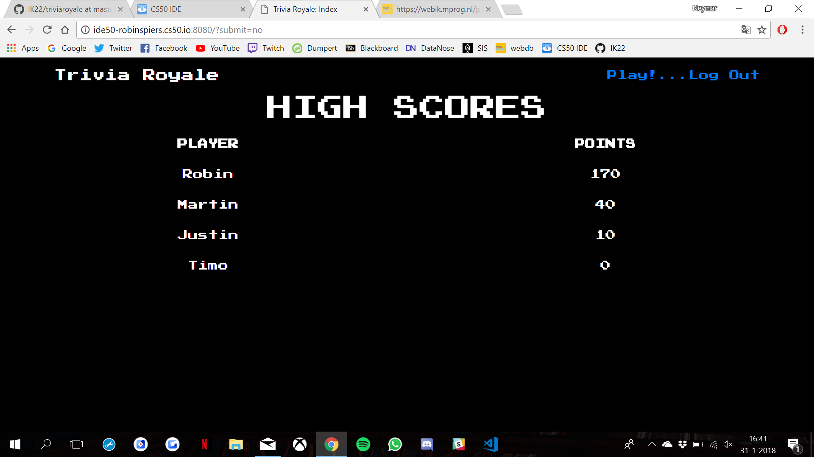

# Webdb IK: Trivia Royale
## Groep IK22: Justin Mensah, Timo Rossenaar en Robin Spiers

### Productvideo

### Samenvatting
Trivia Royale is de grote hit van 2018 wat betreft trivia-websites. Wij gaan de strijd aan met concurrenten _Trivia Crack_ en _Één tegen Honderd_ om het Trivia-genre een nieuw leven in te blazen.
We hebben een website gemaakt waarbij je triviavragen kunt beantwoorden en op die manier punten kan verdienen. Voor elk juiste antwoord krijg je 10 punten, voor alle verkeerde antwoorden wordt je huidige score teruggezet naar 0. Als je veel vragen achter elkaar goed beantwoordt krijg je een hoge score, waardoor je hopelijk een hoge plek krijgt op onze Leaderboard op de homepagina!
Voor de echte liefhebbers gebruiken wij een thema geïnspireerd door de klassieke arcade en 8-bit spellen.

### Features
#### Index pagina:
* De _High Scores_ tabel bekijken
* Een account registeren `Register`
* Inloggen bij een account `Log In`
* Uitloggen bij een account `Log Out`
* Naar het triviaspel gaan `Play!`

#### Het triviaspel:
* Eerst kom je bij het pre-game scherm, waar je uit een van de twee willekeurige categoriën kan kiezen
* Vervolgens krijg je een multiple-choice triviavraag die je moet beantwoorden (de antwoorden zijn gehusseld, zelfs via de source code is niet te achterhalen wat het juiste antwoord is!)
* Na het beantwoorden van een vraag krijg je het juiste antwoord en je huidige score te zien. Daarnaast kun je kiezen of je door wil spelen of juist wil terugkeren naar de homepagina.
* Ook niet-ingelogde gebruikers kunnen het spel spelen, hierbij worden geen gegevens opgeslagen.

### Organisatie
We hebben ons niet echt aan een stricte planning gehouden, maar meer gewerkt in de vorm van een simpele structuur met verschillende energie-pieken.
Uiteindelijk hebben we allemaal gewerkt aan de verschillende onderdelen van de website, maar grotendeels was dit de taakverdeling: Justin was bezig met de database, Robin was vaak bezig met application.py en Timo werkte vooral aan de HTML pagina's.

### Navigatie
Onze code staat in het mapje `/triviaroyale`. Daarin is `application.py` de Controller, waarbij er extra functies zoals getTrivia() en shuffle() in `helpers.py` staan.
De classes die voor interactie zorgen met de database staan in `models.py`. Overigens zijn er nog de twee bestanden `categories.py` en `urls.py` waarin dictionaries staan voor respectievelijk het ophalen van een categorienaam aan de hand van een nummer en het ophalen van een .json pakket van de [online triviadatabase](https://opentdb.com/) aan de hand van een categorienaam.
In het mapje `/templates` staan onze HTML-bestanden, in `/static` staan verschillende CSS-bestanden en ons gebruikte Bootstrap pakket.