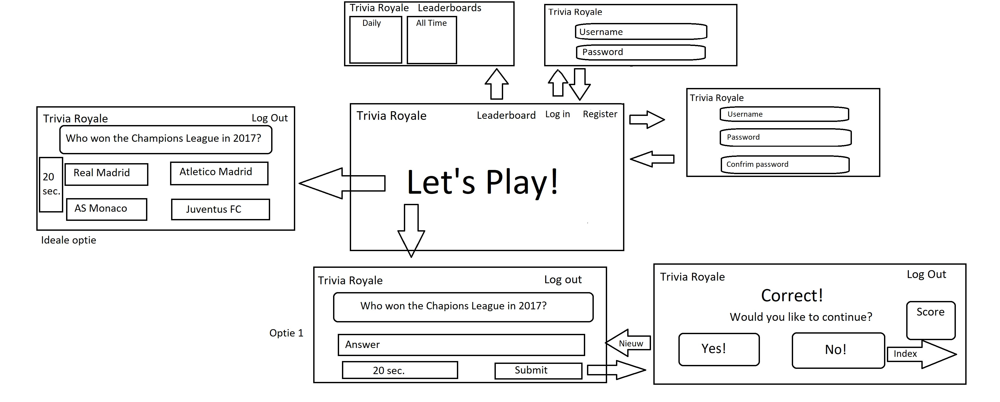

# Webdb IK: Trivia Royale
### Groep IK22: Justin Mensah, Timo Rossenaar en Robin Spiers

#### Samenvatting
Wij willen een trivia website maken, deels gebaseerd op de populaire app trivia crack. Het idee is om een competitie te vormen tussen spelers door middel van een scorebord, die bijhoudt wie de meeste vragen achter elkaar goed heeft beantwoord. Ook willen we bij de geregistreerde accounts player profiles aanmaken, waarbij verschillende gegevens te zien zijn zoals totale aantal beantwoorde vragen, het aantal goede antwoorden tegenover het aantal foute antwoorden etc. De gebruikte trivia vragen zullen uit een online database komen.

#### Schetsen

#### Features
Index pagina:
* Optie om een account aan te maken
* Mogelijkheid om het spel te spelen als ingelogde gebruiker
* Mogelijkheid om het spel te spelen zonder ingelogd te zijn, gegevens worden echter niet opgeslagen
* All Time High Scores of een Daily Leaderboard, met de beste spelers

Het spel:
* Voorafgaand aan een vraag kun je kiezen uit twee willekeurig gekozen categorieën
* Je krijgt een multiple-choice triviavraag die je moet beantwoorden
* Na het voltooien van een vraag kun je terugkeren naar de homepagina
* Na afloop kun je je nieuwe score bekijken

Leaderboard pagina:
* All-time leaderboard, de beste scores allertijden
* Daily leaderboard, de beste scores van die dag
* Verschillende leaderboards gebaseerd op moeilijkheidsgraden en categorieën.

Persoonlijke profiel:
* Verschillende gegevens van de speler bekijken, zoals aantal vragen beantwoord en aantal moeilijke vragen beantwoord etc.
* Mogelijkheid om uit ongeveer 10 standaard-profielfoto's te kiezen
* Mogelijkheid om je wachtwoord te veranderen

#### Minimum Viable Product
Features die wij absoluut op onze website willen hebben:
* Accountregistratie
* Het spel spelen, waarbij een vraag wordt gerenderd vanuit een online triviadatabase
* Het aantal vragen dat de speler goed heeft geantwoord totdat de speler stopt met spelen of een vraag fout beantwoordt, vormt de 'best streak'-score. Deze score komt op de main leaderboard terecht.

#### Triviadatabase
Wij willen gebruik maken van [deze triviadatabase](https://opentdb.com/).

#### Afhankelijkheden
**Databronnen**
Wij willen gebruik maken van een online API database voor trivia vragen, het liefst met de mogelijkheid om te kiezen uit verschillende categorieën en moeilijkheidsgraad.

**Externe componenten**
Wij willen gebruik maken van bootstrap voor het uiterlijk van onze website.

**Concurrentie**
Bestaande spellen waarmee wij willen concurreren zijn dus voornamelijk 'Trivia Crack' en 'Één tegen Honderd'.

**Moeilijke delen**
Wij denken dat het implementeren van het spel één van de moeilijkste taken wordt. Momenteel weten we nog niet echt hoe we met behulp van de triviadatabase vragen en antwoorden kunnen verwerken naar onze eigen website, en hoe we dit kunnen filteren wat betreft categorie en moeilijkheidsgraad.